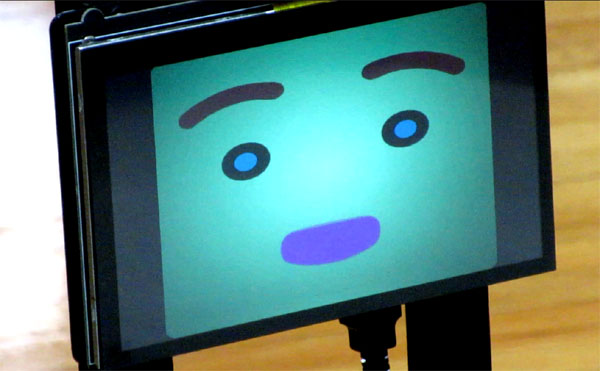

# Hmore Face
## A Graphical Talking Head for Robots

This a simple ROS animated head that can lip sync TTS messages, display a range of expressions, and gaze in various directions. Click the image below for a __video__ of the [Wansui](https://github.com/jconnell11/Wansui) robot using the system:

The system is based on the old Homer Robot Face from the Universitaet Koblenz-Landau (see [this](https://gitlab.uni-koblenz.de/robbie/homer_robot_face/) and [this](https://github.com/homer-robotics/homer_robot_face)) and uses the same Ogre meshes. Yet it offers more than the original Homer. It uses an offline (embedded) TTS engine with tunable voice characteristics. It allows degrees of emotion and blending between certain base expressions. Finally, it can reorient the graphical head to indicate a rough gaze direction. 

  

The code here is for Linux only (no Windows) and has been developed with Ubuntu 18.04 and ROS Melodic. It is known to work with Ogre 1.9.0 and Qt 4.8.7 on a Jetson Nano (Cortex A57). To build then start up the system do:

    cd your_ws
    catkin build hmore_face
    roslaunch hmore_face hmore_face.launch

Some of its capabilities are exercised by this sample [__Python script__](scripts/hmore_test.py) (see starting instructions at bottom of file).

## Text-to-Speech

The ROS node subscribes to string __speak__ messages for use with the Festival TTS system. New requests override any speech already in progress. Typical latency from command to start of audio is around 700ms on a Jetson Nano. The node also publishes a boolean __talking__ message to indicate when the audio is playing (or stops). Some TTS command examples:

    rostopic pub -1 speak std_msgs/String "What's new dude?"
    rostopic pub -1 speak std_msgs/String "The red object is near the tall green thing"

To allow for different voices, the fundamental frequency can be set (around 100 for male, 250 for female, 350 for kid). To avoid sounding like a creepy adult imitating a child, the overall vocal tract formants can be raised (like by 150%). And to aid intelligibility, the speech can be slowed down and given more or less inflection (sing-song quality). Some values from the YAML configuration file [hmore_face.yaml](config/hmore_face.yaml) are:

    voice_freq  : 270            # female fundamental
    voice_infl  : 30             # excited inflection
    voice_shift : 130            # adolescent formants
    voice_slow  : 120            # medium slow
    voice_loud  : 70             # medium volume

## Basic Appearance

The system was designed to use a dedicated display. The animation always appears against a full screen black backdrop, but its active size can be adjusted. As with the original Homer, the face style, skin color, eye color, and feature colors can be adjusted. Again, these are controlled by the ROS parameter file [hmore_face.yaml](config/hmore_face.yaml):

    face_width  : 800            # pixel dimensions
    face_height : 600
    face_xshift : 0              # centered in screen
    face_model  : "Lisa"         # Lisa has lashes
    face_skin   : 0xFFFF40       # yellowish head
    face_back   : 0x40C0FF       # bluish backdrop
    face_iris   : 0xFF00FF       # magenta eye center
    face_stare  : 0x40FF00       # greenish for stare
    face_brows  : 0x402020       # brown eyebrows
    face_eyes   : 0x400080       # lavender eye outlines
    face_mouth  : 0xFF0000       # red mouth

The center of the eye can also be dynamically changed from the "face_iris" color to "face_stare" using the boolean __stare__ ROS message. This is sometimes useful to indicate that the robot is hearing you.

    rostopic pub -1 stare std_msgs/Bool true

Like its progenitor, the face also has a number of autonomous behaviors built-in. The facial features all rise and lower to simulate breathing, the eyes blink semi-randomly, and the whole head occasionally jiggles.

## Expressions

To modulate the face's expression, the node subscribes to point-based __expr__ messages. These consist of a magnitude for the emotion, an angle giving some blend of expressions, and a transition time. The angles corresponding to the original 6+1 Homer emotions are:

          120 unhappy  surprised 60
                   \    /
    180 scared ---- rest ---- happy 0
                   /    \
           240 angry   excited 300

So 90 degrees specifies a face that is both surprised and afraid. Some more examples:

    rostopic pub -1 expr geometry_msgs/Point 1.0 0.0 5.0      # smile slowly
    rostopic pub -1 expr geometry_msgs/Point 1.0 210.0 0.0    # angry and scared
    rostopic pub -1 expr geometry_msgs/Point 0.5 60.0 0.01    # slightly surprised quick

## Gaze

The head can be given an apparent rotation using the point __gaze__ message. The elements here are the desired pan and tilt angles (in degrees) and an angular speed for the motion (degs/sec). Some examples:

    rostopic pub -1 gaze geometry_msgs/Point -- 45.0 0.0 15.0      # look left slowly
    rostopic pub -1 gaze geometry_msgs/Point -- 0.0 -20.0 2000.0   # immediately gaze down
    rostopic pub -1 gaze geometry_msgs/Point -- -35.0 15.0 0.0     # look right and up

Right now the face is a flat disk with the features painted on it. Perhaps a better solution would be to construct a more 3D model (with a nose) and redo the animations. However the needed [tools](http://wiki.ros.org/action/fullsearch/robot_face) are somewhat old and difficult to configure.

## Emotion

You can also subtly modulate some of speech parameters to give an emotional overtone. The direct method is through the __voice__ message. There are 6 basic styles: 0 bored, 1 happy, 2 sad, 3 angry, 4 scared, 5 excited. The second argument in the message is an intensifier (the third argument is ignored). Below are some examples. Of course you also need to send a "speak" message to hear the effect.

    rostopic pub -1 voice geometry_msgs/Point 1 0 0   # happy
    rostopic pub -1 voice geometry_msgs/Point 0 1 0   # very bored
    rostopic pub -1 voice geometry_msgs/Point 5 0 0   # default neutral

There are also __mood__ messages which automatically coordinate facial expression with voice quality. This is based on a bit vector of factors which forms the low order byte of the command, as detailed below. The high order byte has an associated intensifier bit for each condition. 

    [ surprised angry scared happy : unhappy bored lonely tired ]

With "mood" messages you are limited to just these 8 factors, as opposed to the greater flexibility of "expr" messages. However, more than one bit can be set, as is common with the [ALIA](https://github.com/jconnell11/ALIA) reasoning system. Some example messages to try are given below. Note that these essentially override any previous "expr" and "voice" messages.

    rostopic pub -1 mood std_msgs/Int32 0x0090   # happy and surprised
    rostopic pub -1 mood std_msgs/Int32 0x4040   # very angry
    rostopic pub -1 mood std_msgs/Int32 0        # neutral voice and face

## Non-ROS Library

The code in the main repository is all for creating a ROS node. However, you can also compile the system as a simple __static library__ with the [mpi_face](mpi_face) subdirectory. All the basic messages described here are available as simple functions calls (see [mpi_face.cpp](mpi_face/src/mpi_face.cpp)). There is also a Python stub file [mpi_face.py](mpi_face/mpi_face.py) for integration or testing. Note that this code needs to be able to find the contents of the "mesh" subdirectory via the Start() function. And, if you just like the funky voice, there is the [mpi_spout](mpi_face/src/mpi_spout.cpp) library with __TTS only__ (no face) functionality.

---

December 2025 - Jonathan Connell - jconnell@alum.mit.edu
